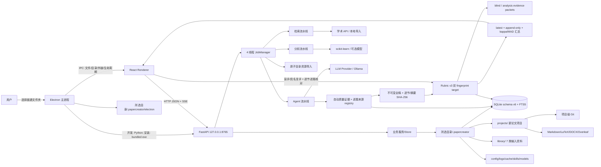
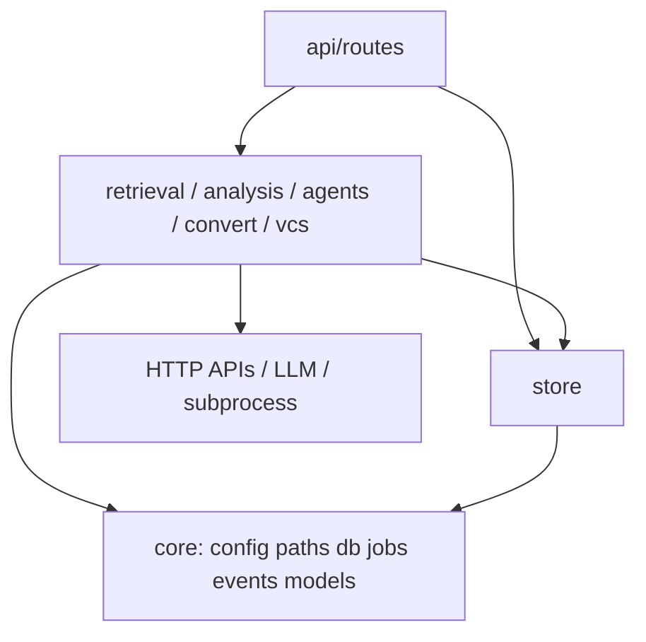

> 文档用途：描述当前真实进程、模块、数据和部署架构  
> 最后检查：2026-07-28  
> 对应代码：`apps/desktop/`、`backend/papercreator/`  
> 文档状态：基于当前代码整理

# 架构

## 总体结构

当前没有独立插件进程、消息队列、定时任务服务、云数据库或认证服务。

## 进程与边界

| 进程 | 入口 | 职责 | 失败影响 |
|---|---|---|---|
| Electron main | `apps/desktop/electron/main.cjs` | 首次/切换工作台、单实例、窗口、菜单、IPC、后端子进程启停、Electron 数据重定向 | Renderer 可显示后端启动错误，但业务不可用 |
| Renderer | `apps/desktop/src/main.tsx` | UI、Zustand 状态、HTTP/SSE 客户端、Three.js/CodeMirror | 不应直接读写文件或密钥 |
| Python/FastAPI | `backend/papercreator/__main__.py` → `api/app.py`；安装态 `papercreator-backend.exe` | 配置、工作台、存储、检索、分析、Agent、导出、Git | 核心服务；绑定回环地址时为本地边界 |
| Job threads | `core/jobs.py` | 搜索、分析、Agent、PDF、目录资源导入等长任务 | 单任务失败持久化，不应杀死 API；目录取消/失败不得留下 ready row |

## 后端分层

- `api/` 负责合同、校验、错误映射和异步任务提交，不应包含算法细节。
- `retrieval/`、`analysis/`、`agents/` 负责领域流水线。
- `agents/quality.py` 生成 quality report v2 和不可变 `review_manuscript`；`agents/review.py` 分离 blind/analysis packet；Agents API 强制 Rubric v3 双指纹、完整性和 stale-form 合同；`store/runs.py` 追加评审并计算 latest/history 与独立 reviewer 一致性。旧 v1/v2 只读兼容，不能伪升级 accepted。
- `store/` 是 SQLite 和项目磁盘的持久化边界。
- `core/` 提供共享模型、配置、路径、数据库、日志、事件和作业基础设施。
- `store/resources.py` 是分类托管导入边界：普通文件同步托管；四类目录经 Job inventory/空间/link/TOCTOU 检查、同盘 staging 分块复制和原子 rename，最后才以相对路径、摘要、来源与 audit 注册到 schema v2。启动会精确回收异常终止的 reserved staging。
- `importers/document_text.py` 是 PDF/DOCX/MD/TXT/TeX 提取边界；`writing/manuscript_import.py` 负责项目手稿两阶段导入；`writing/venue_templates.py` 负责第三方 ZIP 的静态安全检查和审计解压。它们只写当前工作台/项目边界。
- `api/routes/assistant.py` 是只读 LLM 编排层：收集有限项目上下文并返回建议动作，真正写入仍由 Writing/Skills/Versions API 执行。`store/prompts.py` 是 schema v4 提示词模板权威；`store/assistant_chat.py` 以 schema v6 独立保存工作台/项目线程、有序消息与归档来源映射，并负责范围统计、版本化导入导出、幂等恢复及 preview-token 治理，不能混用两者。
- `writing/translation.py` 负责 MyMemory 稳定分块、公共请求限速/重试/取消和 LLM 翻译。Writing API 的 `translation` Job 只生成 durable 完整预览；apply 校验双侧指纹、建立快照并一次写入，Worker 不直接修改手稿。
- `convert/`、`vcs/` 与外部工具交互，必须限制路径、超时并禁止交互式提示。

## 数据权威关系

| 数据 | 权威来源 | 镜像/缓存 |
|---|---|---|
| 文献库、搜索、分析、Agent 运行/质量报告/Rubric v1-v3/冻结正文/评审汇总、快照 | SQLite | 导入源、HTTP/embedding 缓存可重建；正文证据、评审与 fingerprints 不可等价重建，summary 可重算 |
| 手稿正文 | 编辑时 SQLite `sections`；Git/外部编辑时项目文件 | `manuscript/*.md` 双向同步；项目 `.papercreator/manuscript-sync.json` v2 保存整体/逐节双侧 fingerprint，非重叠章节可确认合并，`conflicts/` + snapshot 保存恢复材料 |
| 项目版本历史 | 项目目录中的 Git + SQLite snapshots | 统一时间线是派生视图 |
| Skill 内容 | `SKILL.md` 文件 | SQLite `skills` 缓存元数据/启用状态 |
| 设置/密钥 | `settings.json` / `secrets.json` + 环境层 | API 只返回脱敏值 |
| 工作台资源 | `library/*` 内托管副本 | DB `workbench_resources` 保存相对路径、来源、摘要和项目/论文关联 |
| 最近打开项目 | DB `app_state.last_project_id` | Renderer 内存状态，不使用浏览器 localStorage 作为权威 |

手稿存在双权威切换：普通 UI 编辑后 `flush_to_disk`；Git checkout/pull 或外部编辑后 `reindex_from_disk`。调用方向错误会覆盖修改，详见 [flows/data_write_flow.md](flows/data_write_flow.md)。

## 扩展点

- 检索：继承 `retrieval.base.Provider`，注册到 `retrieval/providers/__init__.py`。
- LLM：实现 `llm.base.LLMBackend`，加入 `llm/backends.py::BACKENDS`。
- Agent：继承 `agents.base.Agent`，注册角色并在 orchestrator 中编排。
- Skill：声明式 `SKILL.md`，不是可执行 Python 插件。
- 分析：当前是代码内策略选择（embedding/reducer/clusterer），尚无稳定算法插件 API。

## 部署关系

开发态 Electron 使用 Vite `5173`，Python 使用 `8765`。生产 renderer 从 ASAR 加载构建文件，仍通过回环 HTTP 访问 `extraResources/backend/papercreator-backend.exe`。根脚本先用 PyInstaller 生成 onedir runtime，再由 electron-builder 生成 NSIS。

安装程序文件只负责应用二进制；用户选择的 `<工作台>/.papercreator/` 位于安装目录之外，覆盖安装和卸载均不得删除。AppData 下只保留用于下次启动定位工作台的 `workbench-location.json`；Chromium userData/cache/local storage 已重定向到当前工作台的 `.papercreator/electron/`。
