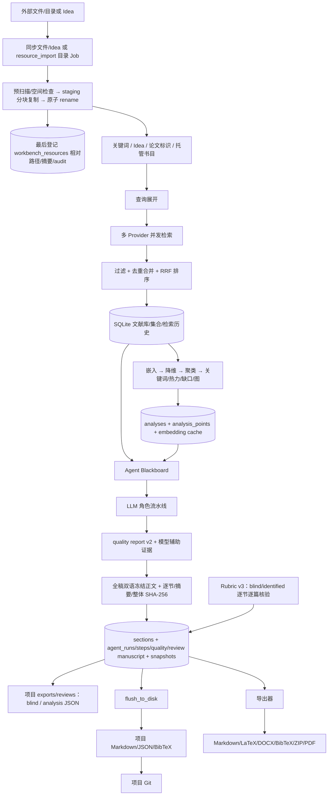

> 文档用途：说明输入、处理、持久化、覆盖与恢复关系  
> 最后检查：2026-07-28  
> 对应代码：`core/db.py`、`store/`、`retrieval/`、`analysis/`、`agents/`  
> 文档状态：基于当前代码整理

# 数据流

## 主业务流

## 数据类别

| 数据 | 来源 | 处理 | 存储 | 覆盖/追加 | 可重建 |
|---|---|---|---|---|---|
| 工作台身份 | Electron 选择普通文件夹 | 建 `.papercreator` 和 manifest | `workbench.json` + AppData 定位指针 | 首次创建；切换不搬迁 | manifest 可重建，路径选择不可猜 |
| 分类输入资源 | 文件/目录/Idea | 文件/Idea 同步托管；四类目录由 Job 预扫描、空间检查、link/reparse 排除、staging 分块复制/摘要、源复核、原子 rename，DB 最后登记；可选解析 Paper | `library/*` + `workbench_resources`；运行中可能短暂有严格 `.partial-res_*` | 每次导入新副本；取消/失败清 staging 且无 ready row；默认删除仅忘记记录 | 原文件可能已不存在，必须备份；staging 可重建 |
| 文献元数据 | 学术 API、Bib/RIS/CSV/JSON、手工 | 标准化、合并、用户字段保护 | `papers` + FTS | upsert 合并 | 部分；用户字段不可可靠重建 |
| 检索记录 | SearchRequest/Provider 结果 | 查询展开、stats、排名 | `searches`、`search_results` | 追加；可删除历史 | 结果可重查但会随外部源变化 |
| Agent 评审证据 | 终态 Blackboard、citation registry | quality v2、冻结全稿、双 fingerprint、Rubric v3 | `agent_runs.result`；可选 `projects/<slug>/exports/reviews/*.json` | Run 内证据不可变；评审只追加；包可重导出 | summary/导出包可重建；冻结正文和人工记录不可丢失 |
| HTTP 缓存 | 学术 API 响应 | TTL/哈希键 | `cache/http` | 覆盖/过期 | 是 |
| Embedding | 标题+摘要 | backend/model/text hash | DB `embeddings` | 同键替换 | 是，但可能慢/有费用 |
| 分析 | 文献集合 | 3D、聚类、热力、缺口、图 | `analyses`、`analysis_points` | 每次新分析；点可增删 | 是，结果受版本/随机种子影响 |
| Idea/自有论文 | 用户 | 分类 Markdown/文件 + `Paper.origin` 特殊点 | `library/ideas|own-papers`、`papers` + 分析点 | 用户显式修改 | 否，应备份 |
| 手稿章节 | UI/Agent/磁盘导入 | 引用、双语、统计 | `sections` + 项目文件 | PATCH 覆盖单章节；快照追加 | 依赖快照/Git，可恢复但不能凭空重建 |
| Agent 运行与验收 | LLM + 确定性检查 + 人工 reviewer | request、prompt、step、usage、diagnosis、partial output、quality report、逐篇来源清单、v2 review target/fingerprint、六维 rubric、评审汇总 | `agent_runs.result`、`agent_steps`、`jobs`、`llm_usage`、pre/post snapshots | Run 追加；human evaluation 只追加；latest 决定只作投影/汇总；JSON parse 失败改写同一 usage 行；可清理 prompt | 模型输出不能完全复现；质量历史不可从手稿等价重建；自动/人工结论均非绝对真值 |
| Skill | 内置/用户/项目文件或 LLM 草稿 | 解析、角色过滤、token budget | `SKILL.md` + `skills` cache | 文件覆盖需显式确认 | 内置可重建；用户/项目不可 |
| Git/快照 | 保存/Agent/用户 | diff、commit、snapshot | `.git` + `snapshots` | 追加；恢复会覆盖当前手稿 | 版本历史本身不可重建 |
| 日志 | 各模块 | 脱敏/轮转 | `logs/*.log` | 轮转覆盖旧文件 | 否，但通常非业务数据 |
| 最近项目/UI 浏览器态 | Renderer/Electron | DB state + Chromium profile | `app_state`、`electron/` | 更新 | 可部分重建 |

## 手稿双向同步

普通方向：`sections` → `documents.flush_document_to_disk()` → `manuscript/NN-key.md|tex`。外部修改方向：Git checkout/手工编辑编号章节文件 → `documents.reindex_from_disk()` → `sections`。`full.md`/`full.tex` 是派生合并预览，会被 flush 重建且不会被 reindex。项目 `.papercreator/manuscript-sync.json` 记录上次确认同步时 DB 渲染镜像和磁盘托管章节文件的独立 SHA-256 摘要；每次覆盖前同时比较当前两侧与各自基线。

安全状态允许单向同步；目标侧变过时返回 HTTP 409 `manuscript_sync_conflict`。manifest schema v2 保存共同基线处每个 section key 的 filename 与 DB/disk fingerprint：若 DB 与磁盘只修改了完全不重叠的既有章节、没有增删或重命名，Renderer 可显示两侧修改集合并在 preview token 仍匹配时确认合并。合并前创建 DB snapshot 和 DB/磁盘恢复镜像；同节双改、结构变化、旧 v1 基线或预览后变化继续阻塞并要求选边。强制选边同样先保存被覆盖侧。CodeMirror 外部 reconciliation 不回送为用户输入；Git discard 先保存 snapshot、磁盘手稿和 binary patch。系统不猜测时间戳，也不提供 CRDT。

## LLM 失败数据流

Provider 响应先经过 backend 协议解析和 terminal-event 校验，再由 `llm/client.py` 写入单行 durable usage。正常结果进入 Agent step output；HTTP/transport/协议/JSON/embedding 失败写入同一结构化 diagnosis，并沿 Step → Run → Job → SSE 传播。若首个 delta 后中断，已收到文本只保存为失败 step 的 `partial_output`，不会进入 `sections` 或覆盖磁盘手稿。orchestrator 仍保存 post-run snapshot，并在 run 上记录原 request、pre-run restore snapshot 与 `recovery.strategy=partial_work_preserved`；桌面重启后可继续审计、重试相同 request，或显式恢复快照。

## Agent 质量证据流

完整项目 Papers 先生成稳定 citation registry，选中 paper 子集只影响上下文，不重排 key。Writer/Reviser/Polisher 的最终 primary text 在 `_persist()` 中重新解析 marker 并成为 `cited_paper_ids` 的权威来源。Run 终态读取最终 Blackboard 与完整 registry，生成 `quality_report`：可判定结构检查和 CitationAgent/Critic 模型辅助判断分别标记；实际被引 Paper 同时固化 citation key、题名、DOI/URL/PDF path 与摘要可用性。随后 reviewer 逐节核对本轮修改、逐篇打开引用来源，填写六维 1–5 Rubric、reviewer、证据 notes、warning acknowledgement 和 decision。后端从当时报告构建 `review_target`，以排除动态 acceptance 投影的 canonical JSON 计算 SHA-256 fingerprint，并在 accepted 时强制 done、pass/warn、完整 section/source coverage、warn 确认、来源确认、六维 ≥3、reviewer 与 notes；通过后才事务追加到 `agent_runs.result.human_evaluations[]`。

旧 v1 评审保持不可变兼容；v2 不回写历史。quality report acceptance 与 `latest_human_evaluation` 是最新状态投影，证据 fingerprint 和 `human_evaluations[]` 是审计历史。汇总的决定/分数按每 Run 最新评审计算，多评审记录数、决定分歧和 score spread 则保留 append-only 语义。自动 gate 即使 pass、人工决定即使 accepted，也都不能证明论断绝对真实；它们只证明相应结构合同和一次有身份/证据说明的审阅已发生。

## 删除语义

- 从分析删除点只删除 `analysis_points`，不会删除全局 Paper。
- 删除 Paper 会影响集合、搜索结果和分析引用；API 有批量入口，调用前应确认范围。
- 删除项目文件只允许在已解析且位于当前 `projects/` 根内的项目路径，并要求确认参数。
- 删除工作台资源默认只删 DB 注册；只有 `remove_files=true` 才删除且必须限制在 `library/` 内。
- 清理 cache/embedding 可恢复；删除 `projects/`、`library/`、DB、Skill 或 snapshot 是不可等价恢复操作。

## 版本与迁移

SQLite 当前 `schema_version=6`：v2 新增 `workbench_resources`，v3 新增双语独立章节目标，v4 新增 `prompt_templates`，v5 新增 `assistant_threads/assistant_messages`，v6 新增 `assistant_thread_imports`；迁移入口在 `core/db.py::init_db()`。工作台 `workbench.json` 是独立 schema v1；项目 `manuscript-sync.json` 是独立 schema v2。任何格式变化都必须增加兼容读取、备份和回滚，不能直接改已发布语义。

手稿导入数据流是：用户选择源文件 → preview 在后端提取/拆节/计算 SHA-256 → Renderer 只接收短摘录和章节元数据 → 用户选择 append/replace → apply 复核源摘要 → replace 前 snapshot → 源文件托管到项目 `.papercreator/imports/` → 所选章节写 SQLite 并 flush。全文不会在 preview/apply 之间经 Renderer 往返。

AI 助手数据流是：Renderer 发送 thread id + 当前问题 + 项目/章节/Skill id → 后端从 DB v6 读取线程最近 30 条消息，并把有限项目上下文作为不可信数据拼入 prompt → LLM 返回纯文本与建议动作 → 成功的一问一答同事务追加 → Renderer 展示 → 用户确认后调用独立 Writing/Skill/Versions API。chat 路由不写手稿、Skill、Git 或 remote；工作台/项目线程持久化且严格隔离。JSON/JSON.GZ 导入先预览来源/内容 fingerprint，再以新本地 ID 原子恢复；相同来源幂等跳过。范围删除和消息脱敏都必须 preview token + confirm，保留天数不会触发自动清理。

翻译数据流是：短文本可同步预览；长文/批量先创建 `translation` Job，Worker 只读取源文本并保存完整译文预览，不更新章节。MyMemory 仅在用户选中且确认公共外发后发起请求，保留代码围栏/展示公式和分隔空白，按 Retry-After 有界重试并在块间检查取消。应用预览时重新核对每节 source/paired SHA-256 和手稿同步状态，创建恢复快照后在一个事务中写全部对照正文并 flush；任何一节变化都拒绝整批应用。
