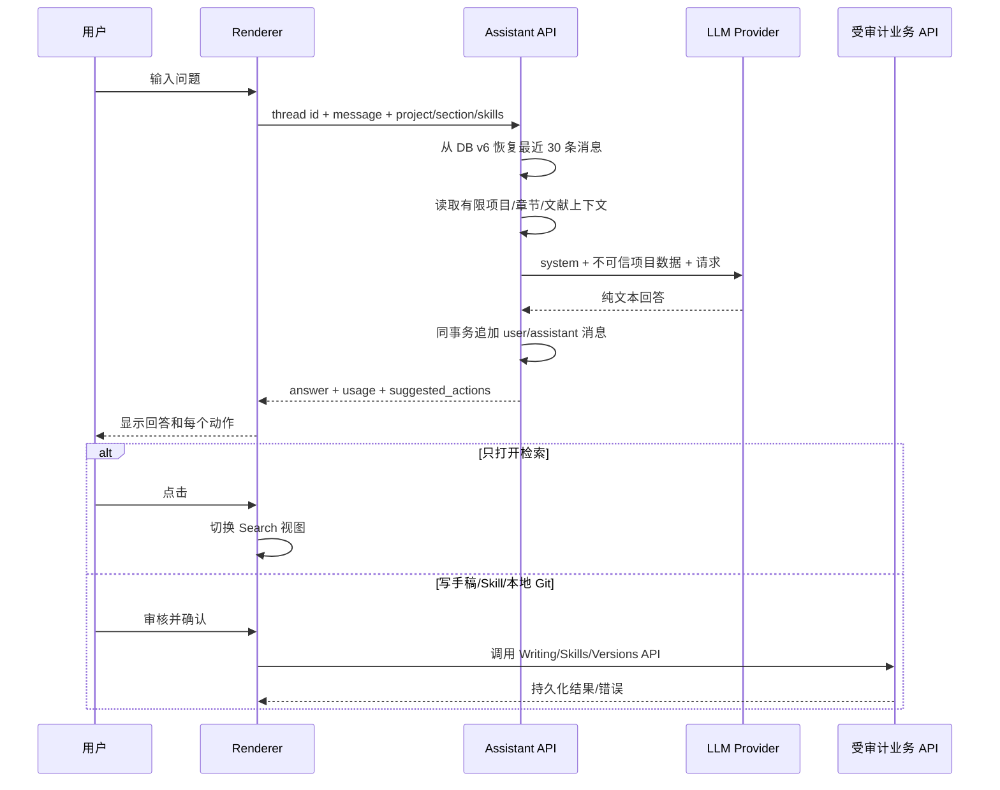

> 文档用途：项目 AI 对话与写入建议的确认边界  
> 最后检查：2026-07-28  
> 对应代码：`backend/papercreator/api/routes/assistant.py`、`apps/desktop/src/components/AssistantPanel.tsx`、Writing/Skills/Versions API  
> 文档状态：部分可用

# AI 助手动作流程

Assistant API 对外部动作仍只读，不得声称动作已经发生。DB v6 持久化线程、消息、建议动作、调用 meta 与归档来源映射；成功一轮原子追加，恢复动作仍需确认。项目正文、Idea、文献摘要和 Skill 均作为不可信数据，不能成为 system 指令。上下文有明确上限：最近 30 条消息、当前节 primary 18k/paired 12k 字符、最多 12 篇文献。

| 动作 | 是否确认 | 真正执行者 | 约束 |
|---|---|---|---|
| `open_search` | 否 | Renderer | 只切视图 |
| `insert_into_section` | 是 | Editor 草稿 | 先进入未保存草稿，仍需保存 |
| `draft_skill` | 是 | Skills API | 用户审核名称/触发词/指令和作用域 |
| `commit_local_version` | 是 | Versions API | 只提交当前项目本地 Git；绝不自动 push |

提示词 `{{variable}}` 使用应用内动态表单填充，不使用 Electron 不可靠支持的 `window.prompt()`。本地提交同样使用应用内表单，并要求用户勾选“只写本地 Git、不会推送”后才启用确认按钮。

线程、消息和导入来源映射位于独立 DB v6 表，关闭/重启后恢复，不与 `prompt_templates` 混用。管理界面按工作台/当前项目显示消息数、字符数、估算字节和最近活动；可把范围内完整 actions/meta 导出为版本化 JSON 或受限 `.json.gz`。桌面 IPC 只读用户明确选择的 JSON/JSON.GZ，压缩前后均限制 256 MiB，不向 Renderer 暴露任意文件读取。

归档导入也是 preview→confirm：预览验证版本、作用域和完整内容 fingerprint，执行时在写事务内重算。目标作用域内仍存在相同来源 ID+fingerprint 时跳过；本地副本删除后可再次恢复；同一来源线程内容改变会生成新本地副本，永不覆盖本地历史。actions 只恢复为建议。

批量删除先生成覆盖候选内容的 SHA-256 token，执行时在 SQLite 写事务内重算；预览后新增/修改消息会使删除失败。保留天数默认关闭，只用于用户主动预览，不做静默自动清理。单条消息的敏感内容清理同样必须预览、说明原因并确认；content、actions 与原 meta 全部不可逆替换，审计只保留原内容 SHA-256、大小、时间和原因，后续导出不含原文。

故障：无 LLM 配置返回可解释 validation error；Skill 注入问题随回答返回；Provider 失败沿用统一 LLM outcome/usage。任何 chat 失败都不能修改项目。
