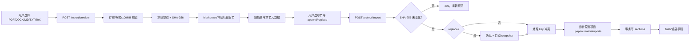

> 文档用途：现有论文/手稿多格式导入和投稿模板包导入流程  
> 最后检查：2026-07-28  
> 对应代码：`backend/papercreator/importers/document_text.py`、`writing/manuscript_import.py`、`writing/venue_templates.py`、`api/routes/writing.py`、`apps/desktop/src/views/EditorView.tsx`  
> 文档状态：基于当前代码整理

# 手稿与投稿模板导入流程

## 手稿正文



- preview 只读，全文留在后端；Renderer 最多收到 2000 字符摘录。
- apply 必须使用 preview 返回的绝对源路径和 SHA-256。预览后源被替换时拒绝，不猜测继续。
- `replace` 必须同时有模式选择和确认；任何删除现有章节前先建立恢复 snapshot。
- 托管副本只能写当前项目 `<project>/.papercreator/imports/`。DB 提交后 flush 失败时保留 snapshot 与源副本供恢复，不静默删除证据。
- 异常：扫描 PDF 无文字层、加密/损坏 PDF、空提取、超限文件、项目不存在、章节选择为空、key 冲突。可自动改 key，但不得覆盖已有章节。

## 投稿排版 ZIP

```text
选择 ZIP → preview 静态检查路径/条目/链接/加密/大小 → 显示 TeX/CLS/STY/BIB 与许可证候选
→ 用户填写来源 URL/许可证并确认有权使用 → apply 复核 SHA-256
→ 解压到临时目录 → 原子放入 assets/venue-templates/<slug>/
→ 原子更新 .papercreator/venue-templates.json
```

ZIP 最大 100 MB、最多 5000 条目、展开最大 200 MB。绝对路径、`..`、Windows 盘符、符号链接和加密条目立即拒绝。导入只保存数据，不执行或编译第三方 TeX。manifest 写入失败会删除新解压目录，避免无审计的半成品。

修改风险：路径 containment、ZIP bomb、许可证误导、SHA-256 TOCTOU、replace 数据恢复和 DB/磁盘同步。修改后至少运行 `test_prompts_assistant_import.py`、非联网后端全量、TypeScript/build，并用临时工作台做 Editor preview/apply。
