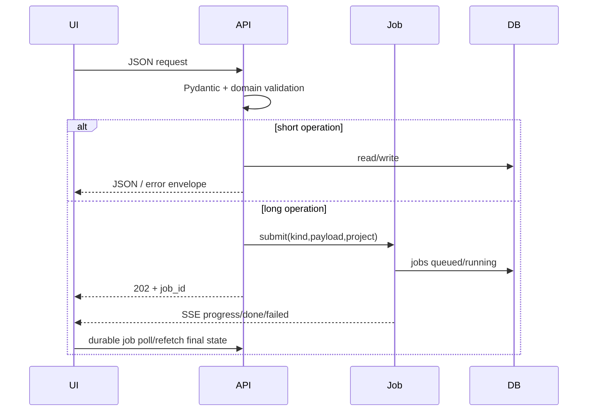

> 文档用途：HTTP 请求、作业和错误处理流程  
> 最后检查：2026-07-28  
> 对应代码：`api/app.py`、`core/jobs.py`、`core/events.py`

# 请求处理流程

业务错误转换为 4xx `{"error":{"code","message","details"}}`；未知异常为 500 并写 errors.log。Job worker 每阶段更新 DB、发布事件并检查取消。Renderer `waitForJob()` 先订阅 SSE、再读取 durable Job，之后每秒轮询兜底；不能假设订阅一定早于任务完成，也不能把 SSE 当唯一事实源。修改作业必须保证结果 JSON 可序列化、失败不逃出线程池、部分结果持久化策略明确。资源目录任务还必须保持 staging/原子 rename/DB 最后登记与取消清理合同。
