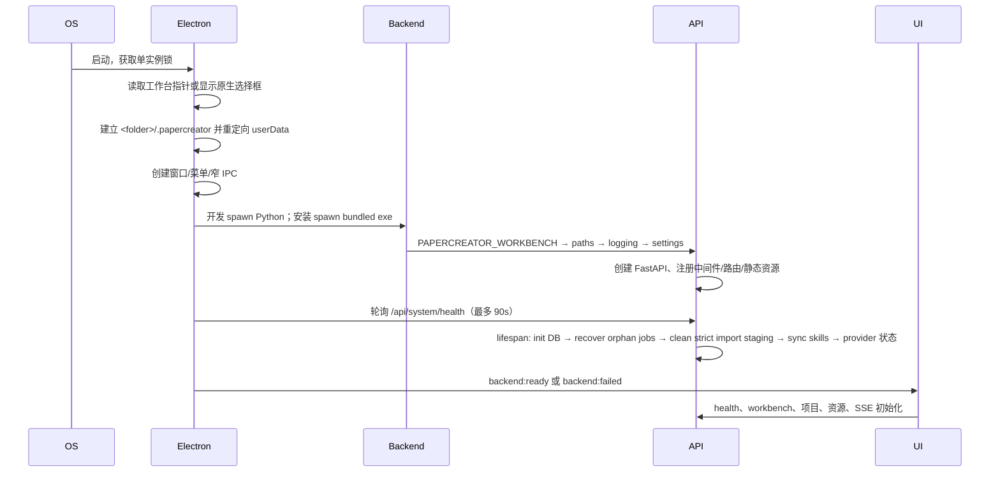

> 文档用途：说明从进程启动到请求、后台任务和退出的真实顺序  
> 最后检查：2026-07-28  
> 对应代码：`electron/main.cjs`、`backend/papercreator/__main__.py`、`api/app.py`  
> 文档状态：基于当前代码整理

# 运行流程

## 桌面启动

`create_app()` 在模块导入时就执行工厂并准备路径/日志/路由；数据库迁移和 Skill 同步在 lifespan 进入时执行。工作台选择必须早于 Chromium 和后端启动，否则浏览器状态或 SQLite 会落到错误位置。Skill 同步失败可降级，工作台不可写或数据库初始化失败不能降级。

首次选择后 Electron 写入 AppData 下的 `workbench-location.json` 并 relaunch；这只是定位指针。实际 Chromium 数据位于 `<工作台>/.papercreator/electron/`。切换工作台同样重启，不会移动或删除旧工作台。

## 请求处理

1. Renderer 从 `api/endpoints.ts` 调用 `api/client.ts`。
2. FastAPI/Pydantic 校验参数；业务错误继承 `AppError` 并返回统一 `error.code/message/details`。
3. 短操作同步返回；检索、分析、Agent、PDF/PDF 下载和四类目录资源导入等提交 JobManager 并立即返回 `job_id`（目录导入端点为 202）。
4. 线程更新 `jobs` 表并通过 EventBus 发布 SSE；全局 UI 同时监听事件并轮询作业。单任务 `waitForJob()` 先订阅 SSE、再读取 durable Job，并每秒轮询兜底，避免任务抢先完成或 Renderer 重连丢失事件。
5. 未捕获异常记录 traceback 到 errors log，客户端收到非敏感 500 包。

## 后台任务

JobManager 固定最多 4 个线程。取消是协作式。Agent 在终态先保存 post-agent snapshot，再构建不可变 review manuscript 与 quality report v2；人工 Rubric v3 只允许终态 Run 追加，accepted 额外重算双指纹和逐节完整性。评审汇总同步计算 latest/history 与独立 reviewer agreement；review packet 导出是短同步、项目内原子文件写入。目录导入的 staging/回收合同保持不变。

本轮已使 JobManager 在线程池 shutdown 后可在同一解释器重新创建 pool，以支持 TestClient/reloader/嵌入式重启。

## 退出

- Electron 为每次 owned backend 生成随机 256-bit `PC_DESKTOP_SHUTDOWN_TOKEN`。原生窗口关闭先重定向到协调式 `before-quit`；主进程通过窄 IPC 请求 Renderer `saveAllSections()`，仍有 dirty/超时则保持窗口和后端打开并显示错误。保存成功后才关闭 Renderer/SSE/polling，再用 capability 调用不进入 OpenAPI 的回环 `POST /api/system/shutdown`。
- `papercreator.__main__` 持有 `uvicorn.Server` 并设置 `should_exit`；backend-only restart 对仍打开的 SSE 使用 2 秒 graceful connection timeout，随后仍进入 FastAPI lifespan。
- FastAPI lifespan 请求活动作业取消、关闭线程池，执行 `PRAGMA wal_checkpoint(TRUNCATE)` 并关闭当前 SQLite 连接；Electron 等待后端退出码。Windows venv launcher 卡死时才在 6 秒后对精确 owned PID 使用 `taskkill /T /F` 兜底，普通退出不依赖它。
- `wait=False` 意味退出优先，不保证长任务完成；业务阶段应在步骤间持久化。

## 降级规则

| 失败 | 行为 |
|---|---|
| 没有 LLM | 检索/分析/编辑仍可用；Agent 只禁用新 Run，历史 Run、质量报告、来源证据、人工评审与汇总仍可查看 |
| 没有 sentence-transformers/UMAP | TF-IDF/PCA/KMeans 回退并写 warning |
| 单个检索源失败 | 记录 provider stats；其他来源继续 |
| Skill 目录损坏 | 跳过单个 Skill；主服务继续 |
| 无 Git | 快照仍可用；Git 功能返回说明 |
| 无 TeX/Pandoc | 内置导出继续；PDF 不可构建 |
| 后端未就绪 | UI 显示诊断和重启入口，不进入业务界面 |
| 工作台不可写 | Electron 在启动后端前拒绝并要求重新选择 |
| Bundled 后端缺失 | 安装态给出可执行文件诊断路径，不回退到系统 Python |
